# 帶你將 Node.js Web App 給 Docker 化，並用 Kubernetes 部署的超簡單範例

公司很早就導入了 Kubernetes（K8s），主要是為了自動化部署以及管理、監測多台機器上的 Container，在遇到高併發情境時可以自動擴展。過去我都是以輔助者的角色跟 DevOps 說我希望有哪些功能，因此對這個技術在懂與不懂之間；所以便藉著寫這篇文章的機會來初探這個已經成為業界潮流的技術。

> 本篇文章是在 Mac 的作業系統下操作的

### 一、安裝 Docker、kubectl、minikube 等工具

- **安裝 Docker**  
  前往[官網下載 Docker 安裝檔](https://docs.docker.com/desktop/mac/install/)，安裝過程就是狂按下一步，這裡就不再多做介紹，下載後要把 App 打開依照步驟執行才算是完成安裝喔！
  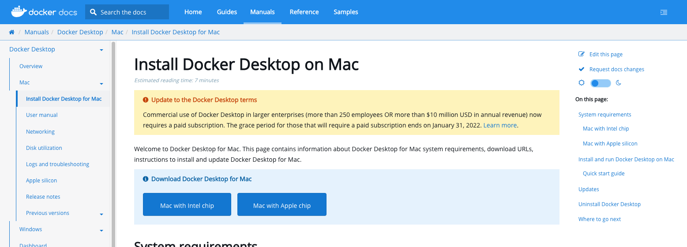
  > 這邊建議順便註冊一組 Docker 帳號，方便你日後的操作。
- **安裝 kubectl**  
  安裝他才能操作 K8s 喔！
  ```sh
  # 安裝 kubectl
  brew install kubectl
  # 確認是否安裝成功
  kubectl version --client
  # 查看目前 cluster 運行狀態
  kubectl get all
  ```
- **安裝 minikube**  
  這個工具可以讓你在本機(Local)架設 K8s 叢集(Cluster)喔！
  ```sh
  # 安裝 minikube
  brew install minikube
  # 啟動 minikube，啟動 k8s cluster
  minikube start
  # 查看 minikube 狀態
  minikube status
  # 取得目前 minikube 的 IP address
  minikube ip
  ```

### 二、建立 Node.js Web App

> 你也可以直接去[筆者的 github](https://github.com/dean9703111/nodejs-docker-k8s-auto-scaling-example)，直接將專案 Clone 到本機來做測試。

- 建立`package.json`
  ```json
  {
    "name": "docker_web_app",
    "version": "1.0.0",
    "description": "Node.js on Docker",
    "author": "Dean Lin",
    "main": "server.js",
    "scripts": {
      "start": "node server.js"
    },
    "dependencies": {
      "express": "^4.17.2"
    }
  }
  ```
- 建立`server.js`

  ```js
  "use strict";

  const express = require("express");

  // Constants
  const PORT = 8080;
  const HOST = "0.0.0.0";

  // App
  const app = express();
  app.get("/", (req, res) => {
    res.send("Hello World");
  });

  app.listen(PORT, HOST);
  console.log(`Running on http://${HOST}:${PORT}`);
  ```

- 在終端機先輸入`yarn`將套件安裝，再輸入`yarn start`確認專案可以運行
  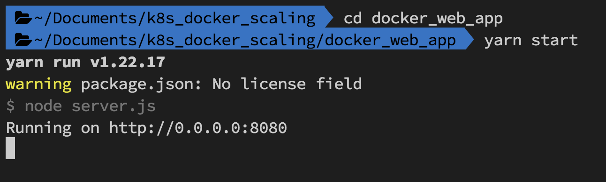
  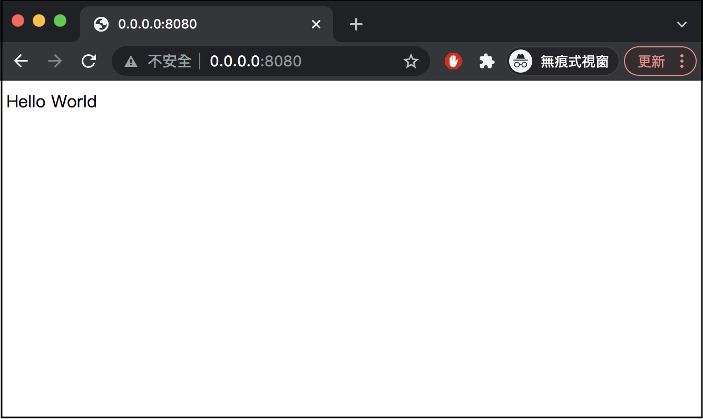

### 三、將 Node.js Web App 給 Docker 化

- 建立`Dockerfile`  
  填寫製作 Docker Image 時需要參考的環境＆指令。

  ```Dockerfile
  FROM node:14

  # Create app directory
  WORKDIR /usr/src/app

  # Install app dependencies
  # A wildcard is used to ensure both package.json AND package-lock.json are copied
  # where available (npm@5+)
  COPY package*.json ./

  RUN npm install
  # If you are building your code for production
  # RUN npm ci --only=production

  # Bundle app source
  COPY . .

  EXPOSE 8080
  CMD [ "node", "server.js" ]
  ```

- 建立`.dockerignore`  
  填寫製作 Docker Image 時不想要複製的檔案。

  ```.dockerignore
  node_modules
  npm-debug.log
  ```

- 製作 Docker Image

  ```sh
  # 登入 Docker
  docker login
  # ！如果 Docker app沒有開啟就執行下面步驟會報錯！
  # 建立 Docker Image
  docker build . -t <your username>/node-web-app
  # 筆者範例指令
  docker build . -t babydragon9703111/node-web-app
  ```

  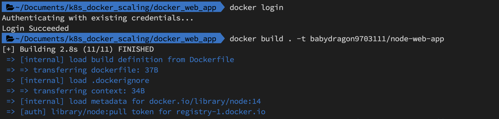

- 印出建立的 Images

  ```sh
  docker images
  ```

  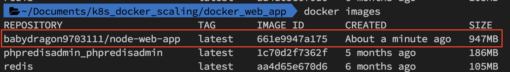

- 將建立好的 Docker Image 跑起來

  ```sh
  # 裡面填寫的 port 是本地端要跑的（對外 port）
  docker run -p [port]:8080 -d <your username>/node-web-app
  # 筆者範例指令
  docker run -p 8080:8080 -d babydragon9703111/node-web-app
  ```

- 確認 Docker Image 運行狀態，並進入網址確認畫面如預期

  ```sh
  # Get container ID
  docker ps

  # Print app output
  docker logs <container id>
  ```

  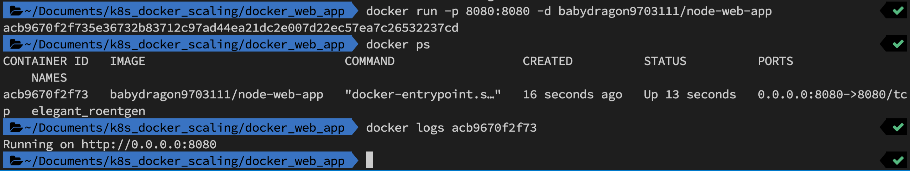
  

### 四、撰寫 K8s 使用的 yaml 檔＆部署 K8s

- K8s 的 yaml 檔基礎說明

  - **apiVersion**：API 版本，需要依照 kind 的物件來決定 version。
  - **kind**：建立的物件。
  - **metadata**：描述物件及標籤。
  - **spec**：物件要的功能。

- 建立`nodetest-k8s.yaml`來做測試範例，裡面的 image 等相關資訊記得算成自己的

  ```yaml
  apiVersion: v1
  kind: Service
  metadata:
    name: node-app-service
  spec:
    selector:
      app: node-web-app
    ports:
      - protocol: "TCP"
        port: 8080
        targetPort: 8080
    type: LoadBalancer

  ---
  apiVersion: apps/v1
  kind: Deployment
  metadata:
    name: node-web-app
  spec:
    selector:
      matchLabels:
        app: node-web-app
    replicas: 3
    template:
      metadata:
        labels:
          app: node-web-app
      spec:
        containers:
          - name: node-web-app
            image: babydragon9703111/node-web-app:latest
            imagePullPolicy: Always
            ports:
              - containerPort: 8080
  ```

- K8s 部署

  ```sh
  # 啟動 k8s cluster
  minikube start

  # 執行部署
  kubectl apply -f nodetest-k8s.yaml
  ```

  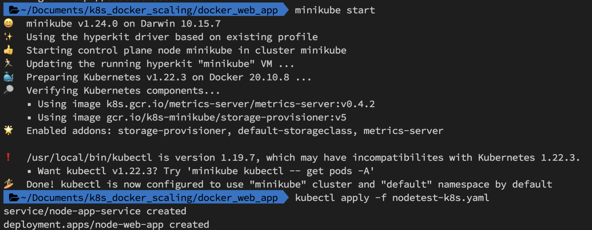

- 查看部署後 pods 狀態

  ```sh
  # 此指令會查 default namespace 的資源
  kubectl get pods
  ```

  因為我們在 spec 的 replicas 的值設為 3，所以會產生 3 個 pods。
  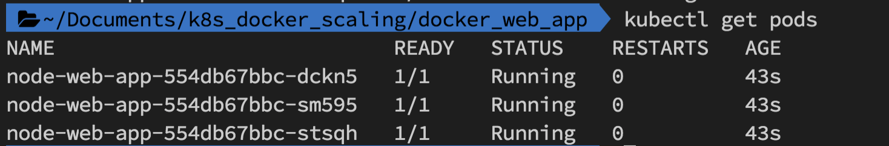

- 取得 deployment 的外部 ip，並點擊確認是否會顯示網頁
  ```sh
  minikube service node-app-service --url
  ```
  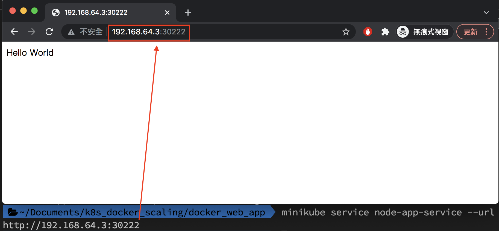
- 如果網頁有正確顯示就大功告成啦～後續想將 K8s 刪除執行如下指令即可
  ```sh
  # 指定刪除剛剛建立的 K8s
  kubectl delete -f nodetest-k8s.yaml
  ```
  剛下達指令刪除時，在 STATUS 的部分會顯示 Terminating，過一段時間就會消失嚕～
  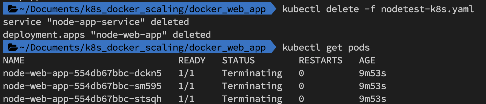

---

# 在 Local 端模擬 K8s Auto Scaling

K8s 最吸引人的其中一個功能應該就是用 Auto Scaling 來應付高併發(High concurrency)情境，今天就用一個水平自動擴展(HPA)的範例來讓大家了解他的實際運作模式。

### 一、撰寫 Auto Scaling 的 yaml 檔

> 你也可以直接去[筆者的 github](https://github.com/dean9703111/nodejs-docker-k8s-auto-scaling-example)，直接將專案 Clone 到本機來做測試。

- HorizontalPodAutoscaler 參數說明
  - scaleTargetRef：填寫你想要針對哪個 ReplicaSet 或 Deployment 或 Replication Controller 來做 Scaling
  - minReplicas、maxReplicas：Pod 擴展範圍
  - targetCPUUtilizationPercentage：Auto Scaling 是根據 CPU 用量來做擴展，判定的依據為 Deployment resources 的 requests 設定值（如果沒填寫基本上就不會動 XD）
- 建立`nodetest-k8s-auto.yaml`來做 Auto Scaling 測試

  ```yaml
  apiVersion: autoscaling/v1
  kind: HorizontalPodAutoscaler
  metadata:
    name: node-web-app
  spec:
    scaleTargetRef:
      apiVersion: apps/v1
      kind: Deployment
      name: node-web-app
    minReplicas: 1
    maxReplicas: 5
    targetCPUUtilizationPercentage: 10
  ```

### 二、調整 Service、Deployment 參數並加入 yaml 檔

> 其實這裡的 Service、Deployment 都是從先前這篇文章改良過來的。

- Service 參數說明
  - nodePort：這裡建議指定一個 port，如果沒有設定的話，最後對外 ip 的 port 為隨機產生
- Deployment 參數說明
  - resources 的 requests：如果 cpu 設定為 `100m`，而 targetCPUUtilizationPercentage 設定為 `10`；當 Pod 的 CPU 使用率為 `1m`（100m x 10%） 的時候就要進行 Auto Scaling。
  - replicas：特別設定為 1 方便觀察，原則上他的值要跟 minReplicas 相同。
- 將如下參數加入剛剛建立的`nodetest-k8s-auto.yaml`中

  ```yaml
  apiVersion: v1
  kind: Service
  metadata:
    name: node-app-service
  spec:
    selector:
      app: node-web-app
    ports:
      - protocol: "TCP"
        port: 8080
        targetPort: 8080
        nodePort: 30390
    type: LoadBalancer

  ---
  apiVersion: apps/v1
  kind: Deployment
  metadata:
    name: node-web-app
  spec:
    selector:
      matchLabels:
        app: node-web-app
    replicas: 1
    template:
      metadata:
        labels:
          app: node-web-app
      spec:
        containers:
          - name: node-web-app
            image: babydragon9703111/node-web-app:latest
            imagePullPolicy: Always
            ports:
              - containerPort: 8080
            resources:
              requests:
                cpu: 100m
                memory: 50Mi
              limits:
                cpu: 200m
                memory: 100Mi
  ```

### 三、部署＆測試 pod 是否會依據流量的增加自動擴展

- 跟著如下步驟操作即可部署有 Auto Scaling 功能的 K8s

  ```sh
  # 將 minikube 監控流量的 addons 打開
  minikube addons enable metrics-server

  # 部署剛剛建立的 nodetest-k8s-auto.yaml
  kubectl apply -f nodetest-k8s-auto.yaml

  # 查看 Auto Scaler 狀態
  kubectl get hpa
  ```

  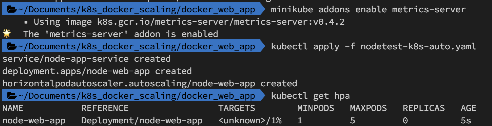

  > 一開始 TARGETS 會顯示 `<unknown>`，這是因為還在判斷流量，過一陣子就會顯示百分比了

- 取得 K8s 外部 ip，然後瘋狂存取他來測試 Auto Scaling

  ```sh
  # 取得 Deployment 的外部 ip（此時會看到 port 與設定的 nodePort 相同）
  minikube service node-app-service --url

  # 開始瘋狂存取剛剛輸出的 url 來確認 pod 是否會自動成長
  while true
  do curl <Deployment 的外部 ip>
  done
  ```

  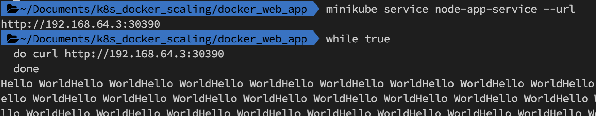

- 確認 pod（看 REPLICAS 這個欄位）是否會依據流量的增加自動擴展到設定的 maxReplicas
  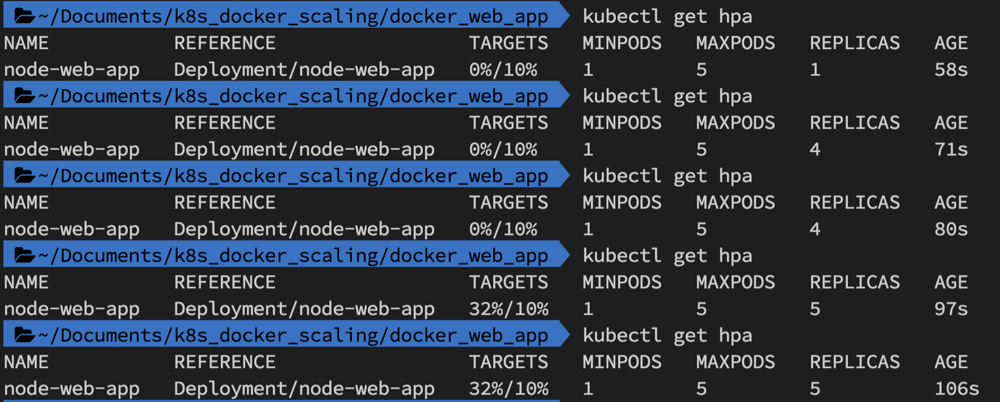
- 將上面的存取 K8s 外部 ip 的 while 迴圈關掉後，pod 會自動減少到設定的 minReplicas
  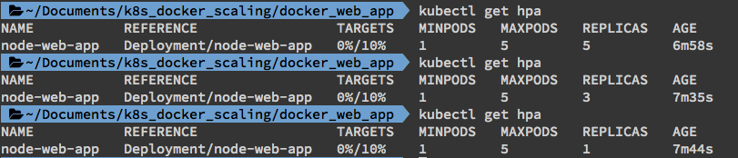
- 測試完成後別忘記把建立的 K8s 服務刪除喔～
  ```sh
  kubectl delete -f nodetest-k8s-auto.yaml
  ```

`如果覺得我寫的文章對你有幫助，千萬不要吝嗇給我一個 ⭐STAR⭐ 喔～`

### 參考資料

- [Kubernetes 那些事 — 基礎觀念與操作](https://medium.com/andy-blog/97cc203a2660)
- [Kubernetes 那些事 — Auto Scaling](https://medium.com/andy-blog/7b887f61fdec)
- [把一个 Node.js web 应用程序给 Docker 化](https://nodejs.org/zh-cn/docs/guides/nodejs-docker-webapp/)
- [如何用 K8S 快速佈建一個 GO SERVER](https://hoohoo.top/blog/kubernetes-k8s-mac-locally-performs-exercises-on-how-to-quickly-build-a-go-server-with-k8s/)
